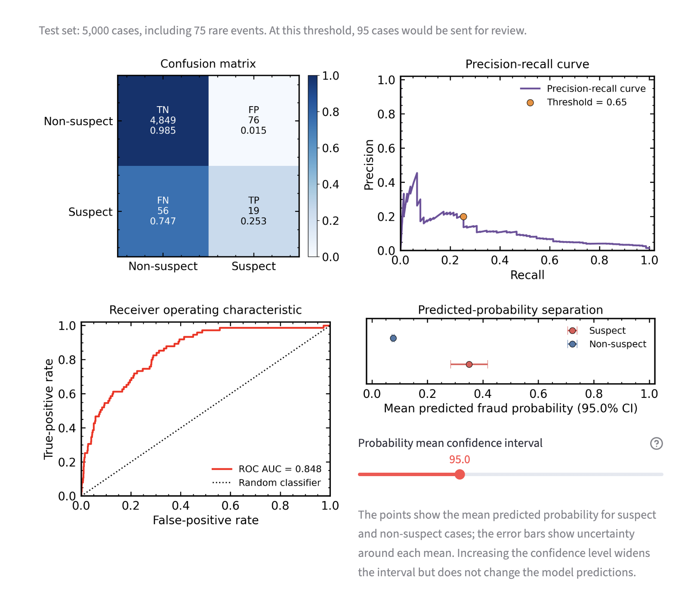
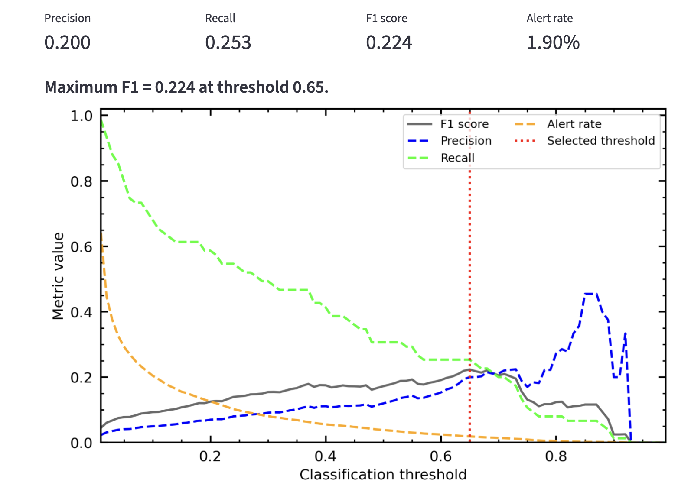

# Fraud Detection & Rare-Event Classification Workbench

An interactive machine-learning workbench for exploring **rare-event classification**, class imbalance and operational decision thresholds.

The project began as a money-laundering detection case study in an online gambling context, using a fully synthetic dataset (25,000 accounts, ~1.5% flagged as suspicious — see [DATA_DICTIONARY.md](DATA_DICTIONARY.md) for the feature set and generation approach). It has since been developed into an interactive Streamlit application that can also be used with other binary classification datasets.

The central question is:

> **How do you detect enough rare events without overwhelming investigators with false alarms?**

Rather than optimising raw accuracy, the workflow focuses on the operational trade-off between **precision, recall, F1 score and alert rate**.

🚀 **Live app: [https://fraud-detection-workbench.streamlit.app](https://fraud-detection-workbench.streamlit.app)**

---

## Key Results: Money Laundering Case Study

For the synthetic gambling AML dataset, XGBoost with class weighting produced approximately:

- **Precision:** 20.0%
- **Recall:** 25.3%
- **F1 score:** 0.224
- **Alert rate:** 1.90%

This means:

- roughly 1 in 5 flagged accounts show genuinely suspicious activity
- approximately 1 in 4 truly suspicious accounts are detected
- around 1.9% of all accounts are sent for review

This illustrates why accuracy alone is a poor metric for rare-event detection — and why, even with real signal in the data (this dataset was validated to have genuine, learnable structure rather than noise), rare-event classification remains a fundamentally difficult, trade-off-driven problem rather than one with a "solved" answer.

---

## Interactive Workbench

The Streamlit application allows users to:

- use the bundled money-laundering case study
- upload their own CSV dataset
- load a public CSV from a URL
- select the binary target and positive class
- exclude identifier or non-predictive columns
- explore predictor distributions by class
- compare alternative classifiers
- compare class-imbalance strategies
- inspect precision, recall, F1 and alert workload
- explore confusion matrices, precision-recall curves and ROC curves
- examine predicted-probability separation
- inspect model feature importance
- dynamically tune the classification threshold

For uploaded datasets, text target labels are cleaned automatically to reduce problems caused by accidental leading or trailing whitespace.

---

## Why Rare Events Are Difficult

Rare-event classification creates several challenges:

- the majority class can dominate model training
- standard accuracy can appear extremely high even when no rare events are detected
- false positives create operational workload
- false negatives allow important events to go undetected
- the best classification threshold depends on the operational objective

For the money-laundering case study, a model predicting every account as legitimate would achieve approximately **98.5% accuracy while identifying no suspicious activity at all**.

---

## Modelling Workflow

### Data preparation

- removes identifier/non-predictive fields from modelling
- uses numeric predictors
- handles missing numeric values using median imputation
- removes constant predictors
- performs the train/test split before any resampling
- preserves the natural class distribution in the held-out test set

### Class-imbalance strategies

The workbench compares:

- **Class weighting** — gives greater importance to minority-class observations without changing the training data
- **SMOTE** — creates synthetic minority-class examples within the training set
- **Under-sampling** — reduces the number of majority-class training observations

Resampling is applied only to training data to avoid data leakage.

### Classifiers

The interactive workbench currently includes:

- **XGBoost**
- **Logistic Regression**
- **Decision Tree**

These provide a useful comparison between high-performance ensemble learning, an interpretable linear baseline and a simple non-linear tree model.

---

## Threshold Optimisation

A classifier produces probabilities rather than inherently deciding which observations should become alerts.

Instead of automatically using the conventional **0.5 threshold**, the workbench evaluates candidate thresholds from **0.01 to 0.99**.

The initial threshold is set to the value that maximises:

**F1 = harmonic mean of precision and recall**

This provides a useful starting point because a high F1 requires both reasonable detection of positive cases and reasonable precision.

Users can then move away from that threshold to explore the operational trade-off between:

- precision
- recall
- false positives
- missed positive cases
- investigation workload

For the money-laundering case study, the F1-maximising threshold for XGBoost is approximately **0.65**.

---

## Evaluation

### Confusion Matrix — Money Laundering Case Study

| | **Predicted Legitimate** | **Predicted Suspicious** |
|---|---:|---:|
| **Actual Legitimate** | 4849 | 76 |
| **Actual Suspicious** |  56  | 19 |

Because the dataset is extremely imbalanced, the normalised confusion matrix contains a very large true-negative proportion. This reflects the underlying class distribution rather than near-perfect overall model performance.

---

## Key Insight

**Real-world model performance is about trade-offs, not perfection.**

A useful rare-event classifier must balance:

- catching enough positive cases (**recall**)
- ensuring alerts are meaningful (**precision**)
- balancing both objectives (**F1**)
- keeping the number of cases requiring review operationally realistic (**alert rate**)

The appropriate threshold therefore depends not only on statistical performance, but also on the cost of false positives, false negatives and investigation capacity.

---

## Data

The bundled case study uses a fully synthetic dataset generated for this project — not derived from any real gambling platform, company dataset or interview assignment. See [DATA_DICTIONARY.md](DATA_DICTIONARY.md) for the full feature list and generation methodology.

---

## Technologies

- Python
- Streamlit
- pandas
- NumPy
- scikit-learn
- XGBoost
- imbalanced-learn
- SciPy
- Matplotlib

---

## Future Improvements

- cost-sensitive optimisation using explicit false-positive and false-negative costs
- model calibration
- additional classifiers
- repeated cross-validation for smaller datasets
- richer feature engineering
- deployment as a production scoring pipeline (see the companion [fraud-detection-api](https://github.com/steviecurran/fraud-detection-api) project)
